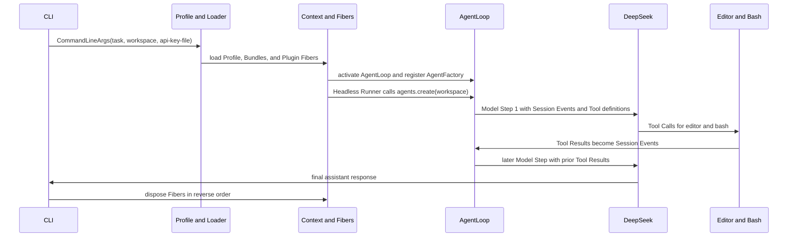

# Nano-dsh Reader Guide

nano-dsh is a small, synchronous teaching harness that shows how a CLI task becomes an Agent Run through dynamic Plugins, real Tools, and a DeepSeek Model Step.

## 1. One complete Agent Run

The normal headless run starts from this command:

```text
nano-dsh "Fix the selected workspace" --workspace "$PWD/../nano-dsh-workspace" --api-key-file "$PWD/.key"
```

This is the end-to-end trace. It is the most useful mental model for the repository.



Here is the same trace with concrete code locations.

1. The CLI parses `task`, `--workspace`, and `--api-key-file` in [nano_dsh/__main__.py](nano_dsh/__main__.py). It resolves the paths and creates `CommandLineArgs`.
2. `main()` passes `cmdline_args` as a root Service to [nano_dsh/boot.py](nano_dsh/boot.py). It selects [profiles/headless.toml](profiles/headless.toml).
3. The Profile lists [bundles/base.toml](bundles/base.toml) and [bundles/headless.toml](bundles/headless.toml). [nano_dsh/loader.py](nano_dsh/loader.py) reads them in that order and imports each Plugin module.
4. The Context creates one Fiber per Plugin. Each Fiber first emits `PENDING`. A Fiber becomes `ACTIVE` only after every required Service is available. The normal order is `sessions`, `agents`, `tools`, `bash`, `editor`, `deepseek`, `agent_loop`, `headless_startup`, and `headless_runner`.
5. `deepseek` reads the one-line key file and provides `llm`. Once `sessions`, `agents`, `tools`, and `llm` exist, [nano_dsh/plugins/agent_loop.py](nano_dsh/plugins/agent_loop.py) activates. It registers an `AgentFactory`; it does not yet create an Agent.
6. [nano_dsh/plugins/headless_runner.py](nano_dsh/plugins/headless_runner.py) is the Driver. It starts the Execution Trace with `llm.system_prompt` and the User Task. It then calls `agents.create(workspace).run(task)`. The factory creates a new in-memory Session.
7. The Agent appends a user Session Event and sends Model Step 1 through [nano_dsh/plugins/deepseek.py](nano_dsh/plugins/deepseek.py). The model can return Tool Calls for `str_replace_editor` and `bash`.
8. [nano_dsh/plugins/editor.py](nano_dsh/plugins/editor.py) or [nano_dsh/plugins/bash.py](nano_dsh/plugins/bash.py) executes each call. A predictable rejection returns `ToolOutput(content, failed=True)`. `ToolsService` traces it as failed and returns its content to the model through a `ToolResultEvent`.
9. The loop sends a later Model Step with the earlier assistant event and Tool Results. It stops when a Model Step has no Tool Calls. It requires and returns non-empty final content.
10. After `boot()` succeeds, `main()` calls `context.dispose()`. Normal cleanup visits Fibers and Effects in reverse order. An unexpected Boot, Plugin, cleanup, JSON, network, filesystem, encoding, or subprocess timeout error propagates directly with its native Python traceback.

The Execution Trace starts with the System Prompt. It then prints the User Task, Reasoning Content, assistant content, Tool Calls, Tool Results, and runtime events. The tracing layer does not record the Provider API key or HTTP headers. Tool output is printed verbatim.

## 2. Minimal vocabulary

| Term | Meaning in nano-dsh |
| --- | --- |
| Profile | A TOML file that selects an ordered list of Bundles. The headless Profile is [profiles/headless.toml](profiles/headless.toml). |
| Bundle | An ordered TOML group of Plugin Specifications. It determines Fiber creation order, not activation order. |
| Plugin | A loadable capability. Its `apply(ctx, config)` function can provide Services or register Effects. |
| Fiber | One applied Plugin instance. It has a lifecycle state and owns the Effects created while it loads. |
| Service | A named capability in the Context. A Plugin requires Service names, not concrete Plugin identities. |
| Effect | A Fiber-owned setup action and optional disposer. Normal disposal runs disposers in reverse registration order. |
| Session Event | One typed in-memory record of user input, assistant output, or a Tool Result. |
| Provider | A Plugin that supplies a Service. The DeepSeek Provider supplies `llm`. |
| Tool Call | A model request with a Tool name and JSON arguments. It becomes a Tool Execution, then a Tool Result. |

## 3. Read the code in five layers

Read one layer at a time. Each layer answers a different question.

### 1. Apps

- Files: [nano_dsh/__main__.py](nano_dsh/__main__.py), [nano_dsh/plugins/headless_startup.py](nano_dsh/plugins/headless_startup.py), and [nano_dsh/plugins/headless_runner.py](nano_dsh/plugins/headless_runner.py).
- Input: command-line task, Workspace path, and API-key-file path.
- Output: final assistant text on standard output and a complete Execution Trace on standard error.
- Why it exists: this layer validates user-facing input and starts exactly one headless Agent Run. The Runner is a Driver. It starts the Agent only after assembly supplies its required Services.

### 2. Boot and Bundle composition

- Files: [nano_dsh/boot.py](nano_dsh/boot.py), [nano_dsh/loader.py](nano_dsh/loader.py), [profiles/headless.toml](profiles/headless.toml), [bundles/base.toml](bundles/base.toml), and [bundles/headless.toml](bundles/headless.toml).
- Input: root Services and the selected Profile.
- Output: an assembled Context in which every enabled Fiber is `ACTIVE`. An unresolved Fiber fails an internal `assert`.
- Why it exists: it makes application composition declarative. It also shows that a Bundle gives creation order while Service availability gives activation order.

### 3. Cordis runtime

- Files: [nano_dsh/cordis.py](nano_dsh/cordis.py) and [nano_dsh/contracts.py](nano_dsh/contracts.py).
- Input: Plugin Specifications, required Service names, and Plugin `apply` functions.
- Output: active Fibers, published Services, and Fiber-owned cleanup.
- Why it exists: this is the minimal dynamic lifecycle. A Consumer can remain `PENDING`, activate when a Provider arrives, return to `PENDING` if that Service disappears, and reactivate when it returns. Normal cleanup runs disposers in reverse registration order.

### 4. Agent core

- Files: [nano_dsh/plugins/agents.py](nano_dsh/plugins/agents.py), [nano_dsh/plugins/sessions.py](nano_dsh/plugins/sessions.py), [nano_dsh/plugins/tools.py](nano_dsh/plugins/tools.py), [nano_dsh/plugins/agent_loop.py](nano_dsh/plugins/agent_loop.py), [nano_dsh/plugins/bash.py](nano_dsh/plugins/bash.py), and [nano_dsh/plugins/editor.py](nano_dsh/plugins/editor.py).
- Input: a task, a Workspace, an `llm` Service, and registered Tool definitions.
- Output: an append-only Session and the non-empty content of the first Model Step without Tool Calls. A Model Step with Tool Calls can have null content. Predictable Tool rejections return `ToolOutput(content, failed=True)`.
- Why it exists: this layer keeps AgentFactory registration separate from Agent creation. It also keeps sequential Tool execution and Session state independent from the provider wire format.

### 5. Provider

- File: [nano_dsh/plugins/deepseek.py](nano_dsh/plugins/deepseek.py).
- Input: Session Events, Tool definitions, and the one-line API key.
- Output: normalized assistant output with final content, optional Reasoning Content, and zero or more Tool Calls.
- Why it exists: this is the boundary between the Agent core and the DeepSeek Chat Completions protocol. It preserves Reasoning Content across Tool-using Model Steps without making the core depend on protocol messages.

## 4. Quick start

Requirements: Python 3.12 and a DeepSeek API key. Production code has no runtime dependencies beyond the Python standard library.

From the repository root, create an isolated Python environment and install the local command:

```bash
python3.12 --version
python3.12 -m venv .venv
. .venv/bin/activate
python -m pip install -e .
```

Create `.key` with exactly one non-empty line. The line is the API key. Do not add quotes or extra lines.

```bash
printf '%s\n' 'your-api-key-goes-here' > .key
```

Create a disposable Workspace. Treat it as writable by a trusted local coding Agent.

```bash
mkdir -p "$PWD/../nano-dsh-workspace"
nano-dsh "Inspect the Workspace and describe its files." --workspace "$PWD/../nano-dsh-workspace" --api-key-file "$PWD/.key"
```

The CLI selects the headless Profile itself. You do not pass a Profile argument. `--workspace` must name an existing directory. The default Workspace is the current directory. The default API-key file is `.key` in the current directory.

## 5. Test

The included Live Acceptance Suite uses three disposable Bug Fixtures: one logic error, one boundary error, and one missing implementation. For acceptance, each run must use the real DeepSeek API, call both `str_replace_editor` and `bash`, return Tool Results to a later Model Step, pass the fixture's `unittest` suite, and finish with final assistant text.

Run it with:

```bash
python examples/example.py --api-key-file .key
```

A successful scenario starts with:

```text
=== SYSTEM ===
You are a coding agent. ...
=== USER ===
Correct the inventory availability calculation. ...
=== REASONING ===
...
=== TOOL CALL ===
...
=== TOOL RESULT ===
...
=== ASSISTANT ===
...
logic-bug: PASS
```

The same sequence repeats for all three fixtures. The final line is `Summary: 3/3 PASS`. Pipe standard output through `tee` to save the complete transcript:

```bash
python examples/example.py --api-key-file .key | tee example-output.log
```

The script performs one attempt per fixture. It does not retry automatically.

## Citation

If you find this repository useful, please cite it as:

```bibtex
@misc{mu2026nanodsh,
  author       = {Guohong Mu},
  title        = {nano-dsh: A Minimal Python Reconstruction of DeepSeek Harness},
  year         = {2026},
  howpublished = {\url{https://github.com/mgh233/nano-dsh}},
}
```
