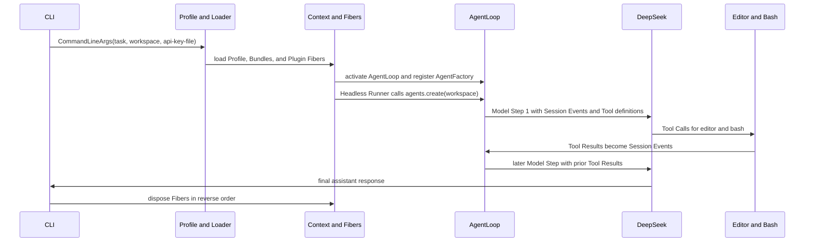

# nano-dsh 读者指南

nano-dsh 是一个小型、同步的教学 harness。它展示了一个 CLI 任务如何经过动态 Plugin、真实 Tool 和 DeepSeek Model Step，成为一次 Agent Run。

先从头到尾读一遍本指南。之后按五层顺序阅读代码。

## 0. 原始 Harness 与教学路径

下表给出直接的教学路径。nano-dsh 保留可见的控制流，并省略无助于解释该路径的 production machinery。

| 层 | 原始 DeepSeek Harness | nano-dsh 教学路径 |
| --- | --- | --- |
| Apps | Production CLI 和应用界面。 | 一个 headless CLI Driver。没有 Web UI 或 session persistence。 |
| Boot / Profile / Loader | Production Profile 组装和 Loader machinery。 | 有序 TOML Profile 和 Bundle 直接加载 Plugin module。没有 Profile Patch overlay 或 hot reload。 |
| Cordis | 具有 production scope 和 asynchronous lifecycle machinery 的动态 Plugin runtime。 | 一个同步 Context，包含 Fiber、Service、Effect、pending Consumer、移除和重新激活。没有 scope、async lifecycle 或 transactional rollback。 |
| Agent core | Production Agent、Session 和 Tool 组装。 | 一个 AgentFactory、一个内存内 Session 和顺序 Tool Call。没有 multi-Agent execution、Skill、Memory 或 Workspace-instruction loading。 |
| DeepSeek Provider / tools | Production Provider 和 Tool integration。 | 一个非 streaming Chat Completions Provider，加上 Bash 和 Editor。没有 retry、streaming、persistent shell 或 operating-system sandbox。 |
| 失败控制流 | Production 各层会转换并恢复部分错误。 | 教学代码没有显式 `raise`、`try` 或 `except` 语句。内部契约使用 `assert`。可预期 Tool 失败使用 `ToolOutput`。其他错误保留 Python 原始堆栈。 |

## 1. 一次完整的 Agent Run

正常的 headless run 从这个命令开始：

```text
nano-dsh "Fix the selected workspace" --workspace "$PWD/../nano-dsh-workspace" --api-key-file "$PWD/.key"
```

这是端到端执行链。它是理解这个仓库最有用的心智模型。



下面用具体代码位置重述同一条执行链。

1. CLI 在 [nano_dsh/__main__.py](nano_dsh/__main__.py) 中解析 `task`、`--workspace` 和 `--api-key-file`。它解析路径，并创建 `CommandLineArgs`。
2. `main()` 将 `cmdline_args` 作为 root Service 传给 [nano_dsh/boot.py](nano_dsh/boot.py)。它选择 [profiles/headless.toml](profiles/headless.toml)。
3. Profile 列出 [bundles/base.toml](bundles/base.toml) 和 [bundles/headless.toml](bundles/headless.toml)。[nano_dsh/loader.py](nano_dsh/loader.py) 按这个顺序读取它们，并导入每个 Plugin 模块。
4. Context 为每个 Plugin 创建一个 Fiber。每个 Fiber 先输出 `PENDING`。只有所需的每个 Service 都可用时，Fiber 才变为 `ACTIVE`。正常顺序是 `sessions`、`agents`、`tools`、`bash`、`editor`、`deepseek`、`agent_loop`、`headless_startup` 和 `headless_runner`。
5. `deepseek` 读取单行 key 文件，并提供 `llm`。当 `sessions`、`agents`、`tools` 和 `llm` 都存在时，[nano_dsh/plugins/agent_loop.py](nano_dsh/plugins/agent_loop.py) 激活。它注册一个 `AgentFactory`；此时还不会创建 Agent。
6. [nano_dsh/plugins/headless_runner.py](nano_dsh/plugins/headless_runner.py) 是 Driver。它先用 `llm.system_prompt` 和 User Task 开始 Execution Trace。然后调用 `agents.create(workspace).run(task)`。Factory 创建一个新的内存内 Session。
7. Agent 追加一个用户 Session Event，并通过 [nano_dsh/plugins/deepseek.py](nano_dsh/plugins/deepseek.py) 发送 Model Step 1。模型可以返回 `str_replace_editor` 和 `bash` 的 Tool Call。
8. [nano_dsh/plugins/editor.py](nano_dsh/plugins/editor.py) 或 [nano_dsh/plugins/bash.py](nano_dsh/plugins/bash.py) 执行每个调用。可预期拒绝返回 `ToolOutput(content, failed=True)`。`ToolsService` 将它记录为 failed，并通过 `ToolResultEvent` 把 content 返回模型。
9. 循环会发送后续的 Model Step。它包含先前的 assistant event 和 Tool Result。它在一个 Model Step 没有 Tool Call 时停止。它要求并返回 non-empty final content。
10. `boot()` 成功后，`main()` 调用 `context.dispose()`。正常 cleanup 按反向顺序访问 Fiber 和 Effect。意外的 Boot、Plugin、cleanup、JSON、network、filesystem、encoding 或 subprocess timeout 错误会直接传播，并保留 Python 原始堆栈。

Execution Trace 从 System Prompt 开始。然后打印 User Task、Reasoning Content、assistant content、Tool Call、Tool Result 和 runtime event。tracing layer 不记录 Provider API key 或 HTTP header。Tool output 会原样打印。

## 2. 最少术语

阅读时使用这些定义。[CONTEXT.md](CONTEXT.md) 是规范术语表。

| 术语 | 在 nano-dsh 中的含义 |
| --- | --- |
| Profile | 选择有序 Bundle 列表的 TOML 文件。headless Profile 是 [profiles/headless.toml](profiles/headless.toml)。 |
| Bundle | 一个有序的 Plugin Specification TOML 组。它决定 Fiber 创建顺序，而不决定激活顺序。 |
| Plugin | 一个可加载能力。它的 `apply(ctx, config)` 函数可以提供 Service 或注册 Effect。 |
| Fiber | 一个已应用的 Plugin 实例。它有生命周期状态，并拥有其加载期间创建的 Effect。 |
| Service | Context 中的一个具名能力。Plugin 依赖 Service 名称，而不是具体 Plugin 身份。 |
| Effect | 由 Fiber 拥有的 setup action，以及可选的 disposer。正常 disposal 按注册的反向顺序运行 disposer。 |
| Session Event | 一个有类型的内存内记录。它可以是用户输入、assistant 输出或 Tool Result。 |
| Provider | 提供一个 Service 的 Plugin。DeepSeek Provider 提供 `llm`。 |
| Tool Call | 模型发出的请求。它有 Tool 名称和 JSON 参数。它会成为 Tool Execution，再成为 Tool Result。 |

不要合并这些概念。Fiber 变为 active 不等于 Agent Run。注册 AgentFactory 不等于创建 Agent。failed Tool Output 仍是模型可见的 Tool Result。

## 3. 按五层阅读代码

一次只读一层。每层回答不同的问题。

### 1. Apps

- 文件：[nano_dsh/__main__.py](nano_dsh/__main__.py)、[nano_dsh/plugins/headless_startup.py](nano_dsh/plugins/headless_startup.py) 和 [nano_dsh/plugins/headless_runner.py](nano_dsh/plugins/headless_runner.py)。
- 输入：命令行任务、Workspace 路径和 API-key-file 路径。
- 输出：标准输出中的 final assistant text，以及标准错误中的完整 Execution Trace。
- 为什么存在：这一层验证面向用户的输入，并启动恰好一次 headless Agent Run。Runner 是 Driver。只有组装过程提供了它需要的 Service 后，它才启动 Agent。

### 2. Boot 和 Bundle 组装

- 文件：[nano_dsh/boot.py](nano_dsh/boot.py)、[nano_dsh/loader.py](nano_dsh/loader.py)、[profiles/headless.toml](profiles/headless.toml)、[bundles/base.toml](bundles/base.toml) 和 [bundles/headless.toml](bundles/headless.toml)。
- 输入：root Service 和被选中的 Profile。
- 输出：一个已组装的 Context。所有启用的 Fiber 都是 `ACTIVE`。未解析的 Fiber 会触发内部 `assert`。
- 为什么存在：它让应用组装是声明式的。它也展示 Bundle 给出创建顺序，而 Service 可用性给出激活顺序。

### 3. Cordis runtime

- 文件：[nano_dsh/cordis.py](nano_dsh/cordis.py) 和 [nano_dsh/contracts.py](nano_dsh/contracts.py)。
- 输入：Plugin Specification、所需 Service 名称和 Plugin `apply` 函数。
- 输出：active Fiber、已发布的 Service 和归 Fiber 所有的清理动作。
- 为什么存在：这是最小的动态生命周期。Consumer 可以保持 `PENDING`，在 Provider 到来时激活，在该 Service 消失时回到 `PENDING`，并在它返回时重新激活。正常 cleanup 按注册的反向顺序运行 disposer。

### 4. Agent core

- 文件：[nano_dsh/plugins/agents.py](nano_dsh/plugins/agents.py)、[nano_dsh/plugins/sessions.py](nano_dsh/plugins/sessions.py)、[nano_dsh/plugins/tools.py](nano_dsh/plugins/tools.py)、[nano_dsh/plugins/agent_loop.py](nano_dsh/plugins/agent_loop.py)、[nano_dsh/plugins/bash.py](nano_dsh/plugins/bash.py) 和 [nano_dsh/plugins/editor.py](nano_dsh/plugins/editor.py)。
- 输入：任务、Workspace、`llm` Service 和已注册的 Tool definition。
- 输出：一个 append-only Session，以及第一个没有 Tool Call 的 Model Step 的 non-empty content。带 Tool Call 的 Model Step 可以有 null content。可预期 Tool 拒绝返回 `ToolOutput(content, failed=True)`。
- 为什么存在：这一层让 AgentFactory 注册与 Agent 创建分离。它也让顺序 Tool 执行和 Session state 独立于 Provider wire format。

### 5. Provider

- 文件：[nano_dsh/plugins/deepseek.py](nano_dsh/plugins/deepseek.py)。
- 输入：Session Event、Tool definition 和单行 API key。
- 输出：归一化的 assistant output。它包含 final content、可选的 Reasoning Content 和零个或多个 Tool Call。
- 为什么存在：这是 Agent core 与 DeepSeek Chat Completions protocol 之间的边界。它跨含 Tool 的 Model Step 保留 Reasoning Content，但不让 core 依赖 protocol message。

完成这一轮后，请读离线集成测试 [tests/test_headless_app.py](tests/test_headless_app.py)。它使用 scripted transport，在没有网络请求时展示同一个生命周期。

## 4. 快速开始

要求：Python 3.12 和一个 DeepSeek API key。生产代码除了 Python 标准库外没有运行时依赖。

在仓库根目录中，创建隔离 Python 环境，并安装本地命令：

```bash
python3.12 --version
python3.12 -m venv .venv
. .venv/bin/activate
python -m pip install -e .
```

创建 `.key`，内容必须恰好是一行非空文本。该行是 API key。不要加引号或额外行。

```bash
printf '%s\n' 'your-api-key-goes-here' > .key
```

创建一个可丢弃的 Workspace。把它视为可信本地 coding Agent 可以写入的位置。

```bash
mkdir -p "$PWD/../nano-dsh-workspace"
nano-dsh "Inspect the Workspace and describe its files." --workspace "$PWD/../nano-dsh-workspace" --api-key-file "$PWD/.key"
```

CLI 自己选择 headless Profile。你不传入 Profile 参数。`--workspace` 必须是一个已存在的目录。默认 Workspace 是当前目录。默认 API-key file 是当前目录中的 `.key`。

## 5. 用两种方式测试

### 完整离线 unit test suite

无需 API key 或网络访问，运行：

```bash
python -m unittest discover -v
```

这个 suite 验证 Fiber lifecycle、动态加载、反向 Effect cleanup、Session serialization、Reasoning Content round-trip、有序 Tool Call、Editor confinement、Bash behavior，以及完整的 scripted headless Agent Run。

### 三 fixture 的 Live Acceptance Suite

仓库已包含 Live Acceptance Suite。它使用三个可丢弃的 Bug Fixture：一个 logic error、一个 boundary error 和一个 missing implementation。要满足验收要求，每次 run 都必须使用真实 DeepSeek API，同时调用 `str_replace_editor` 和 `bash`，把 Tool Result 返回给后续 Model Step，通过 fixture 的 `unittest` suite，并以 final assistant text 结束。

运行命令：

```bash
python examples/example.py --api-key-file .key
```

一个成功场景从下面的内容开始：

```text
=== SYSTEM ===
You are a coding agent. ...
=== USER ===
Correct the inventory availability calculation. ...
=== REASONING ===
...
=== TOOL CALL ===
...
=== TOOL RESULT ===
...
=== ASSISTANT ===
...
logic-bug: PASS
```

三个 fixture 都会重复这个序列。最后一行是 `Summary: 3/3 PASS`。通过 `tee` 保存标准输出，就能得到完整轨迹：

```bash
python examples/example.py --api-key-file .key | tee example-output.log
```

脚本对每个 fixture 只执行一次。它不会自动 retry。

验证记录（2026-08-20）：本版离线测试通过 84/84，真实 API Live Acceptance 通过 3/3。生产 Python 包含 812 行非空、非注释代码。最大生产文件包含 148 行。仓库共有 34 个 Python 文件，AST `Raise`、`Try` 和 `TryStar` 节点都为零。

## 6. 安全边界和失败行为

- Bash 是 trusted local capability。它从所选 Workspace 启动，但不是 operating-system sandbox。它可以访问该进程通常可访问的 host resource。
- 每次 Bash Tool Execution 都启动一个新的 `/bin/bash` 进程。shell state 不会持久化。它有 300 秒 timeout，以及 16,000 字符的 model-visible output limit。
- `str_replace_editor` 只接受绝对路径。它会解析路径，并拒绝 Workspace 外的目标，包括 symbolic-link escape。这个路径限制不会 sandbox Bash。
- `.key` 被 Git 忽略。Provider 将一个非空行读入内存。Bash 子进程环境会移除 `DEEPSEEK_API_KEY`。
- Execution Trace 包含 Reasoning Content、Tool argument、Tool Result、command 和模型看见的 Workspace content。tracing layer 不记录 Provider API key 或 HTTP header。Tool 仍可能暴露它读到的 secret。
- Provider request 或 live suite 没有 automatic retry。没有 Model Step cap。
- 内部不变量使用简洁 `assert`。例如 Service Provider 唯一、AgentFactory 唯一、DeepSeek 响应形状正确，以及 final assistant content 非空。
- 可预期 Tool 失败返回 `ToolOutput(content, failed=True)`。例如未知 Tool、非零 Bash exit 和被拒绝的 Editor 操作。`ToolsService` 将 content 写回模型，并记录 failed trace。
- JSON、network、filesystem、encoding 和 subprocess timeout 错误不做包装。Python 会暴露原始堆栈。

请为 live run 使用可丢弃的 Workspace。不要把 secret 或重要 host file 放在 Bash 或 Execution Trace 可以暴露的位置。

## 7. 刻意未实现的内容

nano-dsh 保持教学链足够小。它刻意不包含：

- Web UI 和 session persistence。
- Scope isolation 和 multi-Agent execution。
- Streaming response 和 asynchronous execution。
- Profile Patch overlay 和 configuration hot reload。
- Transactional rollback。
- Persistent Bash、PTY support 和 background job。
- Operating-system sandbox。
- Automatic API retry 和 Model Step limit。
- Skill、Memory 和 Workspace instruction loading。

这些省略是设计的一部分。它们让完整执行链可读，同时不声称覆盖 production harness。

## 8. 通过 branch 和 worktree 协作

在独立 worktree 中只做一个被分配的变更。用 Conventional Commit 提交这个变更。独立的只读 reviewer 检查 branch。在同一个 branch 上修复可操作的问题。运行 branch test。之后用 `--no-ff` 合并到 `main`，并再次运行 main test。不要 squash branch。

这个流程保留可审查的实现历史，同时避免多个 worker 修改同一个 worktree。

## 9. 继续阅读规范文档

[CONTEXT.md](CONTEXT.md) 是规范术语与 runtime glossary。当本指南中的术语仍不清楚时，请阅读它。

[PLAN.md](PLAN.md) 说明产品边界、runtime contract、verification target 和协作 gate。

[docs/adr/](docs/adr/) 记录难以逆转的选择：semantic fidelity、动态 Plugin lifecycle、trusted Bash、Session/Provider separation、延后 Agent creation、代码行数上限、synchronous execution、Python 3.12 无运行时依赖，以及 failed `ToolOutput` semantics。
